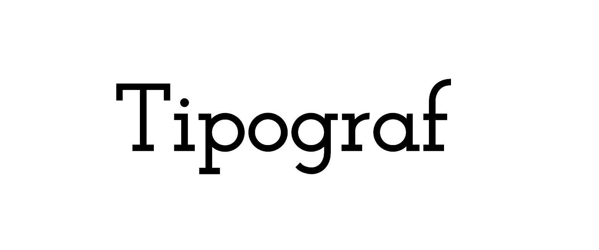

<p align="center">
	<a href=""></a>
</p>

#  :book: tipograf
[](https://badge.fury.io/gh/tiaanduplessis%2Ftipograf) [](https://badge.fury.io/js/tipograf) [](https://badge.fury.io/bo/tipograf) [](https://travis-ci.org/tiaanduplessis/tipograf) [](https://cdnjs.com/libraries/tipograf) [](http://standardjs.com/)

**tipograf** is a Lightweight typography base. It is available in pure CSS or Less.  Heavily inspired by [Medium](https://medium.com/), it tries to **enforce good vertical rhythm**.

## :scream: Highlights
- Written entirely in relative units.
- Highly customizable.
- Lightweight(**minified version being just 680 bytes when gzipped**)

## Install
**Install with cdn**
```html
<link rel="stylesheet" href="https://unpkg.com/tipograf/dist/tipograf.css">
<!-- Or -->
<link rel="stylesheet" href="https://cdn.rawgit.com/tiaanduplessis/tipograf/master/dist/tipograf.css">
<!-- Or -->
<link rel="stylesheet" href="https://cdnjs.cloudflare.com/ajax/libs/tipograf/1.0.4/tipograf.css">
```

**Install with Bower**
```sh
$ bower install tipograf
```

**Install with npm**
```sh
$ npm install tipograf
```

**Install with yarn**

```sh
$ yarn add tipograf
```

## Usage
**tipograf** is **highly customizable** and should be changed to meet your preference :+1:.

## Demo
Check out the demo [here](https://tiaanduplessis.github.io/tipograf/).

## Contributing
All Contributions are welcome! Please open up an issue if you would like to help out. :smile:

## License
Created with ♥ by [Tiaan du Plessis](https://github.com/tiaanduplessis). Licensed under the MIT License.
